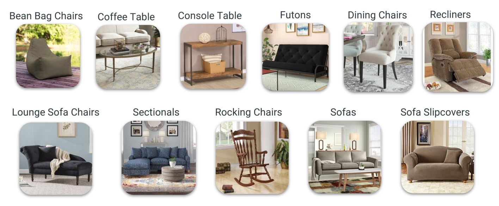
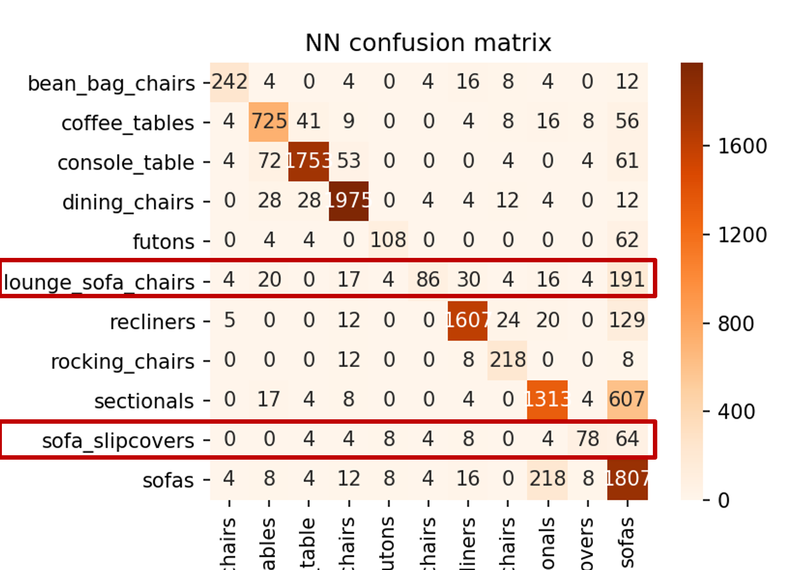
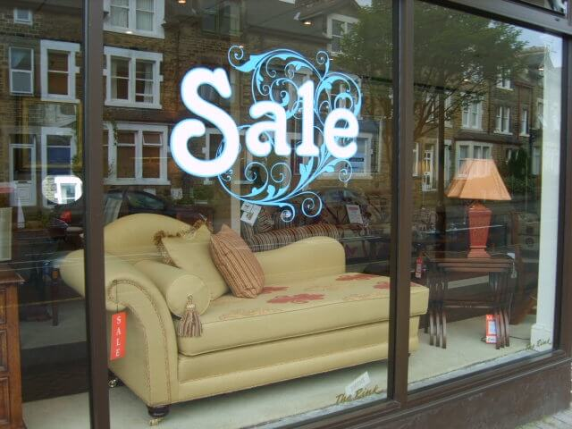
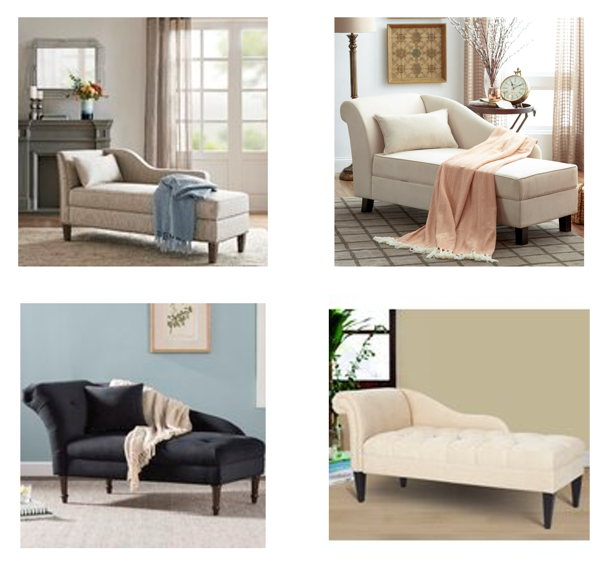
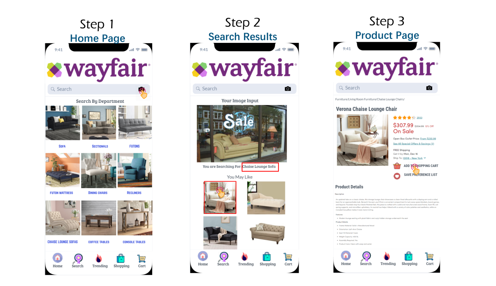

# Furniture Finder App

Remember the time back to college when you shopped at Ikea with roommates? Have you ever wished to look up products with similar design carried by other brands while walking through showrooms? 

### Project Goal

To build an app that is able to find most similar furniture carried by Wayfair.

### Data Collection

I scraped 14,839 images in total, including 11 furniture categories, from Wayfair.com using **Selenium** and **BeautifulSoup**. 

Below briefly gives an idea about what each category looks like.
 

Some very common furniture categories — such as sofas, sectionals, and console table — have thousands of products, while a few less popular categories — such as bean bag chairs, futons, and lounge sofa chairs — have as little as 400 products. Class imbalance impact will be tested after training the model.

### Modeling

I used **transfer learning** built on pre-trained **Convolutional Neural Network VGG16 model** and then added sequential layers to classify image categories within the 11 categories.

Images used are reset as 240 * 240 pixels.

After training completes, I extracted **Feature Vectors** from the model and used them to calculate **Cosine Similarity** to find most similar images.

### Results

First, I want to see whether class imbalance has any influence to the model on learning each categories. To do so, I have generated **confusion matrix** below. 

 

The confusion matrix clearly shows that model captures well on most of the categories, except lounge sofa chairs and sofa slipcovers, which are generally different types of sofas with slightly diffenert shapes. Therefore, accuracy and f1-macro score are effective to evaluate model performance. 

Evaluation score on test images:

| Metric   |  Score   |
|----------|----------|
| Accuracy |   0.826  |
| F1-macro |   0.763  |

Next, I want to see whether images that the model finds closely related do look similar. I'm using furniture images grabbed randomly online to testify.

#### Test 1
 

Model classifies image as:  _**Chaise Lounge Sofa**_

Most Similar Images Found By The Model:

I'm happy to see that the model is able to capture the round one-side handle and curvy shape back with most similar colors.

### The App

To display the result, I built an interface app prototype using Marvel which is shown below. 

**Step 1: Home Page** 

On the home page, users can click the *camera* button and take a photo of the furniture they want to search.

If the user is not using the visual search button, he/she can also browse by product departments.

**Step 2: Image Search Results**

Once searching the image, the model first **classifies the input as one of the eleven categories**. **Within that defined category**, it calculates the cosine distance between vectors of the searched image and those of other images in the entire dataset, then **returns top images with closest cosine distance**. 

Due to space limitation of the app page, I choose to show only 4 product images. Each image is linked to its detailed product page.

**Step 3: Product Page**

Users can click on the product that he/she is interested in and get detailed product descriptions on this page. Additionally, users are able to add the product to cart or add to preference list as well. 
